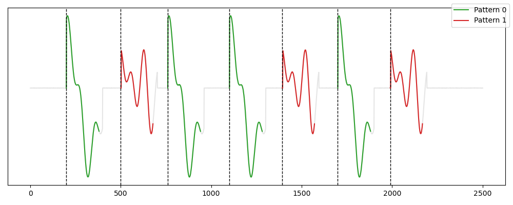
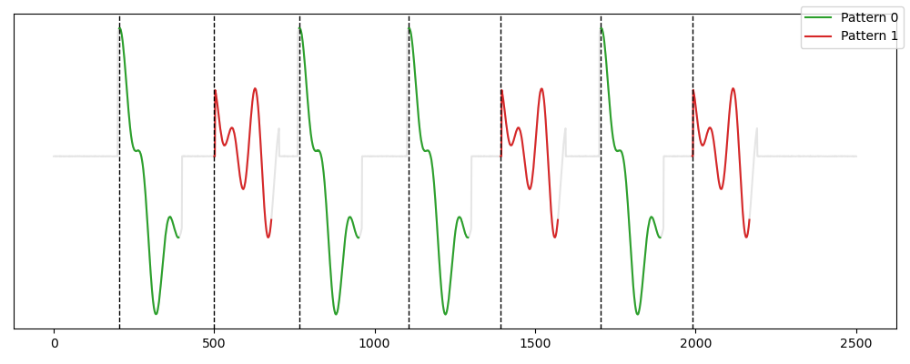
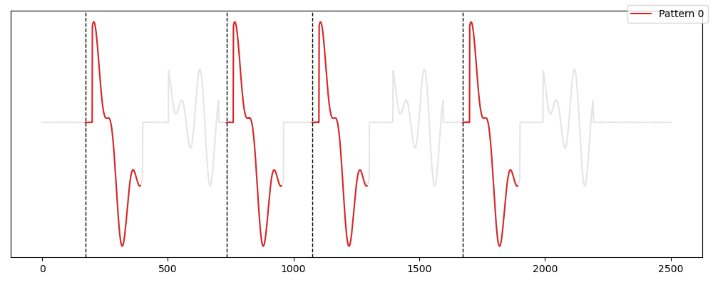
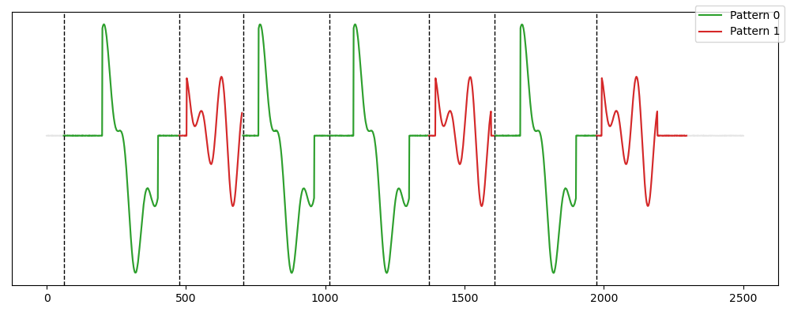
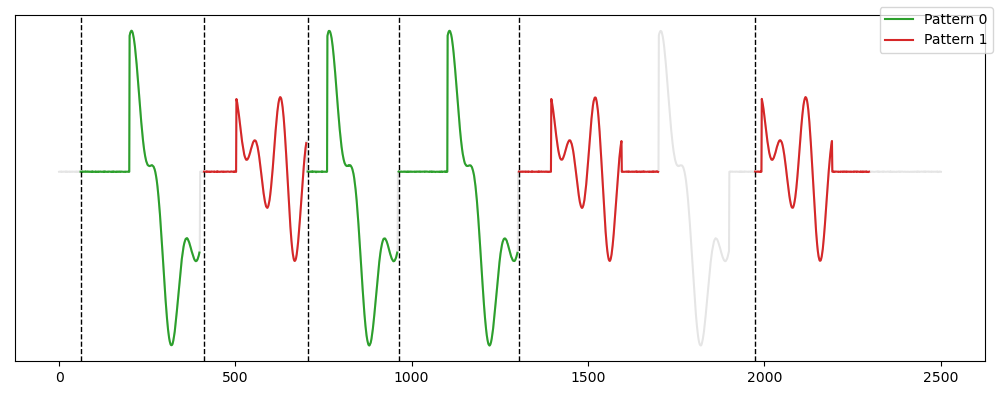

# Similarity-based Algorithms in TSMD

## STOMP

The STOMP algorithm [Yeh et al. 2016] is a similarity-based method and proposes a fast computation of the Matrix Profile by efficiently leveraging the Fast Fourier Transform (FFT). Once the  Matrix Profile is computed, the center of the Motif Set is defined as the subsequence with the minimum distance to another non-overlapping subsequence. A full scan of the time-series subsequences is performed, and non-overlapping subsequences that are at a distance of less than $R$ from the center are identified as occurrences of the corresponding Motif set.

```{eval-rst}  
.. autoclass:: tsmd.competitors.matrixprofile.MatrixProfile
    :members:

```

### Usage

```python
from tsmd.competitors.matrixprofile import MatrixProfile
from tsmd.tools.utils import transform_label
from tsmd.tools.plotting import plot_signal_pattern


mp=MatrixProfile(n_patterns=2, wlen=200, radius_ratio=3, distance_name = 'UnitEuclidean')
mp.fit(signal)

labels=transform_label(mp.prediction_mask_)
plot_signal_pattern(signal,labels)
```


### Reference

[Yeh et al. 2016] Chin-Chia Michael Yeh, Yan Zhu, Liudmila Ulanova, Nurjahan Begum, YifeiDing, Hoang Anh Dau, Diego Furtado Silva, Abdullah Mueen, and Eamonn Keogh. 2016. Matrix profile I: all pairs similarity joins for time series: a unifying view that includes motifs, discords and shapelets. In 2016 IEEE 16th international conference on data mining (ICDM). Ieee, 1317–1322

## PanMP 

PanMP [Madrid et al. 2019] aims to generalize the Matrix Profile approach to detect patterns at varying time scales without requiring prior knowledge of the Motif size. To achieve this, the PanMatrixProfile—a matrix that contains Matrix Profiles for a range of window lengths in a time series—is computed. Based on distance and regardless of window size, the best non-overlapping Motif Pairs are then iteratively selected. The Motif sets are constructed from these selected Motif Pairs in the same way as in STOMP. Note that if the range of window sizes is restricted to a single value, this method functions identically to STOMP.

```{eval-rst}  
.. autoclass:: tsmd.competitors.panmatrixprofile.PanMatrixProfile
    :members:

```

### Usage

```python
from tsmd.competitors.panmatrixprofile import PanMatrixProfile
from tsmd.tools.utils import transform_label
from tsmd.tools.plotting import plot_signal_pattern


pmp=PanMatrixProfile(n_patterns=2, min_wlen=180, max_wlen=220, radius_ratio=3, distance_name = 'UnitEuclidean')
pmp.fit(signal)

labels=transform_label(pmp.prediction_mask_)
plot_signal_pattern(signal,labels)
```




### Reference

[Madrid et al. 2019] Frank Madrid, Shima Imani, Ryan Mercer, Zachary Zimmerman, Nader Shakibay, and Eamonn Keogh. 2019. Matrix profile xx: Finding and visualizing time series motifs of all lengths using the matrix profile. In 2019 IEEE International conference on big knowledge (ICBK). IEEE, 175–182

## VALMOD 

VALMOD [Linardi et al. 2018] has a similar goal to PanMP but employs a slightly different approach. It leverages pruning techniques to compute the Matrix Profile over a range of window lengths, $\ell$. Motif Pairs are iteratively selected based on distance normalized by the square root of the window length. Motif sets are then built from these top Motif Pairs by identifying non-overlapping subsequences within a distance $< R$ from one of the two centers. 

```{eval-rst}  
.. autoclass:: tsmd.competitors.valmod.Valmod
    :members:

```

### Usage

```python
from tsmd.competitors.valmod import Valmod
from tsmd.tools.utils import transform_label
from tsmd.tools.plotting import plot_signal_pattern


valmod=Valmod(n_patterns=2, min_wlen=180, max_wlen=220, radius_ratio=3, distance_name = 'UnitEuclidean')
valmod.fit(signal)

labels=transform_label(valmod.prediction_mask_)
plot_signal_pattern(signal,labels)
```




### Reference

[Linardi et al. 2018] Michele Linardi, Yan Zhu, Themis Palpanas, and Eamonn Keogh. 2018. Matrix profile X: VALMOD-scalable discovery of variable-length motifs in data series.In Proceedings of the 2018 international conference on management of data. 1053–1066.

## $k$-Motiflets 

Unlike most other algorithms in our benchmark that require the user to set a radius parameter $R$, the k-Motiflets [Schäfer et al. 2022] method aims to discover motifs without needing this parameter. Instead, the user specifies the desired number of occurrences $k$ for the target motif. With $k$ defined, the method identifies the set of $k$ non-overlapping subsequences with minimal extent, where extent is the maximum pairwise distance among elements in the set.

```{eval-rst}  
.. autoclass:: tsmd.competitors.motiflets.Motiflets
    :members:

```
### Usage

```python
from tsmd.competitors.motiflets import Motiflets
from tsmd.tools.utils import transform_label
from tsmd.tools.plotting import plot_signal_pattern


mf=Motiflets(k_max=5, min_wlen=180, max_wlen=220)
mf.fit(signal)

labels=transform_label(mf.prediction_mask_)
plot_signal_pattern(signal,labels)
```




### Reference

[Schäfer et al. 2022] Patrick Schäfer and Ulf Leser. 2022. Motiflets: Simple and Accurate Detection of Motifs in Time Series. Proceedings of the VLDB Endowment, 16, 4 (2022), 725–737.

## PEPA

```{eval-rst}  
.. autoclass:: tsmd.competitors.persistence.BasePersistentPattern
    :members:

```

This method [Germain et al. 2024] extracts the motifs through three computational steps: (i) the time series is transformed into a graph with nodes representing subsequences and edges weighted by the distance between subsequences; (ii) persistent homology is applied to detect significant clusters of nodes, isolating them from nodes that correspond to irrelevant parts of the time series; and (iii) a post-processing step merges temporally adjacent subsequences within each cluster to form variable length motif sets. Note also that this method utilizes the LT-Normalized Euclidean distance, a distance measure invariant to linear trends.

### Usage

```python
from tsmd.competitors.persistence import BasePersistentPattern
from tsmd.tools.utils import transform_label
from tsmd.tools.plotting import plot_signal_pattern


pepa=BasePersistentPattern(wlen_for_persistence=180, n_patterns=2)
pepa.fit(signal)

labels=transform_label(pepa.prediction_mask_)
plot_signal_pattern(signal,labels)
```




### Reference

[Germain et al. 2024] Thibaut Germain, Charles Truong, and Laurent Oudre. 2024. Persistence-based motif discovery in time series.IEEE Transactions on Knowledge and Data Engineering (2024).

## A-PEPA 

A variant of PEPA [Germain et al. 2024] that does not require the user to define the exact number of motif sets and estimates it automatically.

```{eval-rst}  
.. autoclass:: tsmd.competitors.adaptative_persistence.AdaptativeBasePersistentPattern
    :members:

```

### Usage

```python
from tsmd.competitors.adaptative_persistence import AdaptativeBasePersistentPattern
from tsmd.tools.utils import transform_label
from tsmd.tools.plotting import plot_signal_pattern


apepa=AdaptativeBasePersistentPattern(wlen_for_persistence=180)
apepa.fit(signal)

labels=transform_label(apepa.prediction_mask_)
plot_signal_pattern(signal,labels)
```




### Reference

[Germain et al. 2024] Thibaut Germain, Charles Truong, and Laurent Oudre. 2024. Persistence-based motif discovery in time series.IEEE Transactions on Knowledge and Data Engineering (2024).
